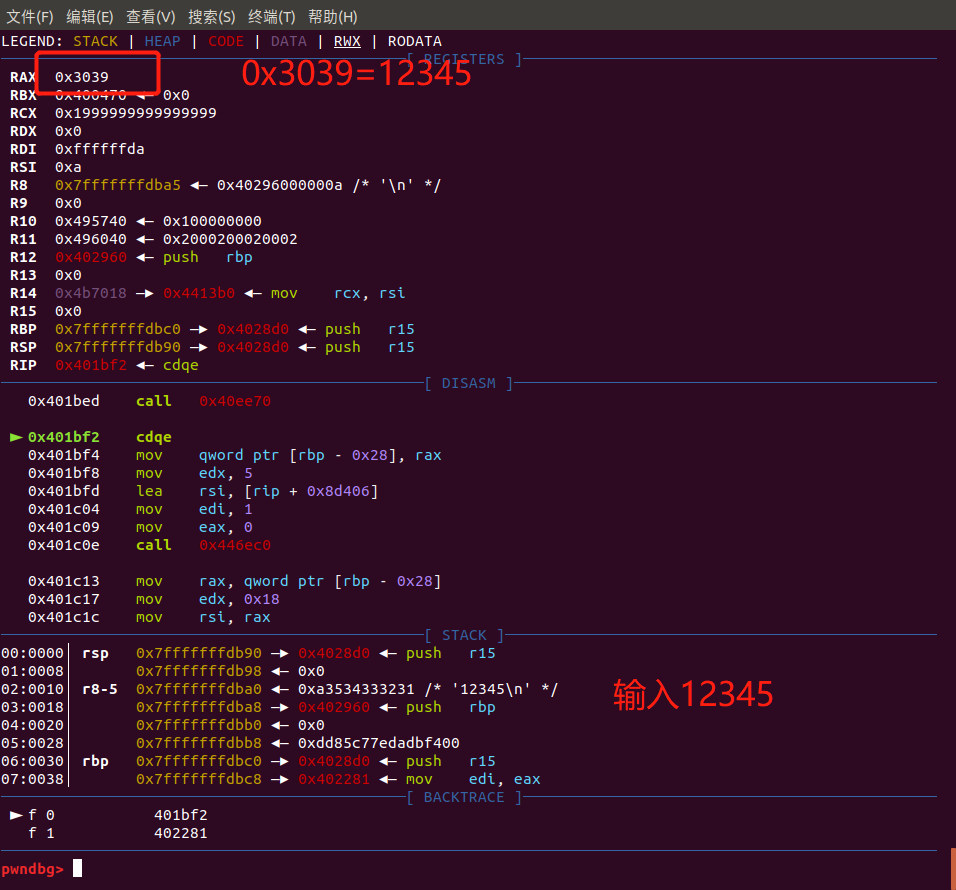
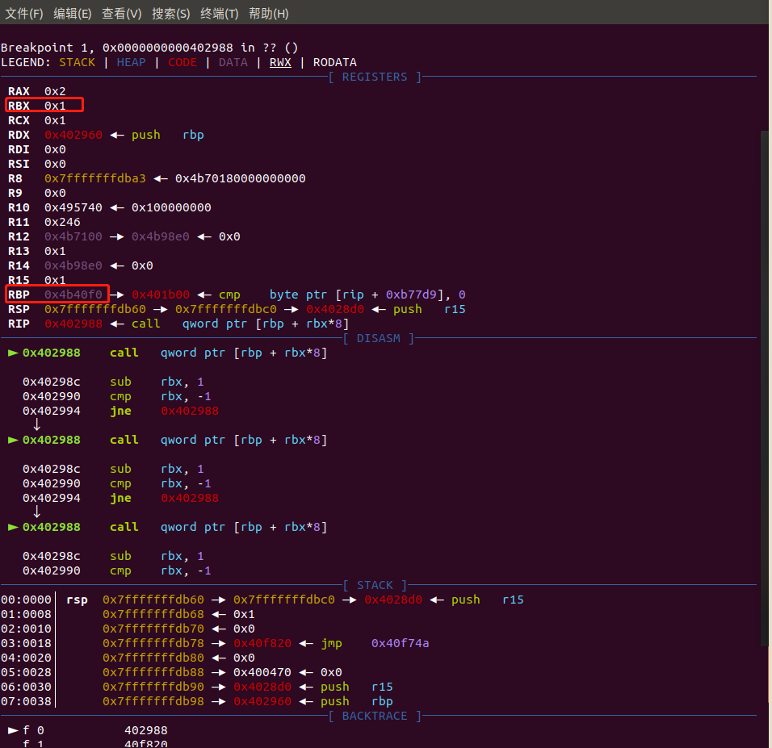

## 0x00 分析

checksec之

```
Arch:     amd64-64-little
RELRO:    Partial RELRO
Stack:    No canary found
NX:       NX enabled
PIE:      No PIE (0x400000)
```

ida分析，发现有大量函数，同时没有加载符号，判断该程序采用静态编译，推测是ROP的题

这时候可以通过工具，如[lscan](https://github.com/maroueneboubakri/lscan)来复原符号文件，不过该题靠自己猜测也能达到同样目的
相关知识见[链接](https://xz.aliyun.com/t/4484)

<font color=d55fde>*主要是该题复原不了*</font>
<font color=d55fde>*教练我想学看汇编*</font>

**首先**，没有符号，需要自己找到main函数，关键函数

运行3x17，有"addr"等字符串，通过在IDA查找（`alt`+`T`），发现位于`0x0000000000401B6D`上的函数，猜测此为关键函数，分析该函数

当然，这里可以了解`_start`函数的结构，调用`__libc_start_main`时，RDI的参数即为main函数，但这里没有符号表，可以使用比对的方式，找到`__libc_start_main`再进一步分析

**接着**，分析该函数的效果

通过调试与系统的调用，猜测各个函数的效果。很明显，.bss段上的`0x4B9330`记录次数，仅当该值为0的时候才可以自加1，进入读写流程。读写流程中，先在终端上输入地址，然后在所输入的地址上写值。

不过，这里的.bss上的`0x4B9330`似乎有点多此一举，值得注意

对于`sub_40EE70((__int64)&buf);`函数，gdb调试一下，首先输入了`12345`这一字符串，而`sub_40EE70`的返回值按照x64架构规则，是放入在寄存器`RAX`中，结果是`0x3039`，恰好是`12345`的十六进制，因此猜测`sub_40EE70`用于将字符转换为整数



得到最终的逻辑

附：[__fastcall](#__fastcall)

```c
__int64 __fastcall sub_401B6D(__int64 a1, char *a2, __int64 a3)
{
  __int64 result; // rax
  char *v4; // ST08_8
  char buf; // [rsp+10h] [rbp-20h]
  unsigned __int64 v6; // [rsp+28h] [rbp-8h]

  v6 = __readfsqword(0x28u);
  result = (unsigned __int8)++byte_4B9330;
  if ( byte_4B9330 == 1 )
  {
    // 在fd=1，当前情况下是在终端上写5个字符 
    my_write(1u, "addr:", 5uLL);
    // 从fd=0，当前情况下从终端读取写入的24个字符
    my_read(0, &buf, 0x18uLL);
    v4 = (char *)(signed int)atol((__int64)&buf);
    my_write(1u, "data:", 5uLL);
    my_read(0, v4, 0x18uLL);
    result = 0LL;
  }
  if ( __readfsqword(0x28u) != v6 )
    sub_44A3E0();
  return result;
}
```

<!-- TODO -->
怀疑静态编译的情况下，这是main函数，那么ida自己的添加的符号`start`是否是其他程序的`_start`，再次使用IDA查看汇编，没什么区别。

那么根据其他编译的x64程序，对本程序的`0x401A50`函数重命名，得到：

```
; =============== S U B R O U T I N E =======================================

; Attributes: noreturn

                public _start
_start          proc near               ; DATA XREF: LOAD:0000000000400018↑o
; __unwind {
                xor     ebp, ebp
                mov     r9, rdx
                pop     rsi
                mov     rdx, rsp
                and     rsp, 0FFFFFFFFFFFFFFF0h
                push    rax
                push    rsp
                mov     r8, offset __libc_csu_fini
                mov     rcx, offset __libc_csu_init
                mov     rdi, offset main
                db      67h
                call    __libc_start_main_ptr
                hlt
; } // starts at 401A50
_start          endp

; ---------------------------------------------------------------------------
                align 20h
; [00000001 BYTES: COLLAPSED FUNCTION nullsub_1. PRESS CTRL-NUMPAD+ TO EXPAND]
                align 10h

; =============== S U B R O U T I N E =======================================
```

因此，该题很可能是需要构造ROP，那么函数劫持点在哪？ROP链如何构建？

这里查看`__libc_csu_fini`这一函数，本程序对应的地址是`0x402960`，重点是`0x402988`这段语句，`call    qword ptr [rbp+rbx*8+0]`

这里下个断点

```py
b *0x402988
```



可见，RBP上的值是`0x4b40f0`，紫色，代表数据，在IDA一查，可得该处地址为`.fini_array`

<!-- ? 为什么是通过汇编可以看出是倒着调用？ RBP么，栈帧起始地址，然后从高地址向低地址什么的？ 但是这时候 rbp 指向的是 0x4b40f0 啊，明显不是栈的地址 除非是堆，数组是从高往低排，rbp指向数组end末尾-->

通过搜索引擎可知，main函数执行完毕后，会按次序执行`.fini_array`上的函数，整体的函数流程即


<!-- 

1. 下断点调试 rbp
2. 下断点查看 .fini_array

大致是通过地址任意写，对.fini_array的值重写，再劫持控制流什么的
-->

### 函数的劫持

### ROP链的构建

[Ropgadget](https://github.com/JonathanSalwan/ROPgadget)

## 参考资料

* https://xuanxuanblingbling.github.io/ctf/pwn/2019/09/06/317/

## 参考知识

### <span id="__fastcall">调用协议</span>

调用协议常用场合：

* __stdcall： Windows API默认的函数调用协议。
* __cdecl：   C/C++默认的函数调用协议。
* __fastcall：适用于对性能要求较高的场合。


函数参数入栈方式：

* __stdcall：  函数参数 **由右向左** 入栈。
* __cdecl：    函数参数 **由右向左** 入栈。
* __fastcall： **从左开始不大于4字节的参数** 放入CPU的ECX和EDX寄存器，其余参数 **从右向左** 入栈。

    __fastcall在寄存器中放入不大于4字节的参数，故性能较高，适用于需要高性能的场合。

栈内数据清除方式：
* __stdcall： 函数调用结束后由 **被调用函数** 清除栈内数据。
* __cdecl：   函数调用结束后由 **函数调用者** 清除栈内数据。
* __fastcall：函数调用结束后由 **被调用函数** 清除栈内数据。

**注意**

* 不同编译器设定的栈结构不尽相同，跨开发平台时由函数调用者清除栈内数据不可行。
* 某些函数的参数是可变的，如printf函数，这样的函数只能由函数调用者清除栈内数据。
* 由调用者清除栈内数据时，每次调用都包含清除栈内数据的代码，故可执行文件较大。

### .fini_array

参考资料：
* http://b0ldfrev.gitbook.io/note/pwn/zhong-xie-.finiarray-han-shu-zhi-zhen
