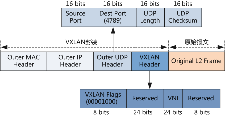

## 计算虚拟化技术概述

虚拟化使得在一台物理的服务器上可以跑多台虚拟机，虚拟机共享物理机的 CPU、内存、IO 硬件资源，但逻辑上虚拟机之间是相互隔离的

主流的虚拟化架构分为：

* 容器模式
* 主机模式
* 裸机模式
* 混合

<!-- Todo 待整理 虚拟化架构分类众说纷纭 -->

虚拟化技术基于Hypervisor将宿主机Host的硬件资源虚拟化给客户机Guest，通过Hypervisor实现的方式的不同分为

* 一型虚拟化 
    * 直接在物理机上的虚拟化，多个虚拟机在 Hypervisor 上运行
    * Hypervisor 实现方式一般是一个特殊定制的 Linux 系统
    * 代表技术：Xen，ESXI

      

* 二型虚拟化 
    * Hypervisor 作为 OS 上的一个程序模块运行，并对管理虚拟机进行管理。
    * 代表技术：KVM，VirtualBox 和 VMWare Workstation
    
      

目前较流行的是KVM(Kernel-Based Virtual Machine)虚拟化技术结合 Qemu 来实现虚拟化

* KVM 是基于 Linux 内核实现的，KVM 有一个内核模块叫 kvm.ko，只用于管理虚拟 CPU 和内存。
* 那 IO 的虚拟化，如存储和网络设备交给 Linux 内核和 Qemu 来实现。

KVM 本身只关注虚拟机调度和内存管理这两个方面。IO 外设的任务交给 Linux 内核和 Qemu。

### KVM

### Qemu

<!-- todo 是否需要增加部分ctf qemu的题？ -->

## 网络虚拟化

下图是一个简单的使用了Open vSwitch（OVS）虚拟网络的逻辑图

>https://access.redhat.com/documentation/en-US/Red_Hat_Enterprise_Linux_OpenStack_Platform/5/html/Cloud_Administrator_Guide/section_networking-scenarios.html

简单的说一下图中的意思

该图有三个虚拟机 vm01，vm02，vm03。其中 vm01、vm03有各有一块虚拟网卡eth0并分配了一个ip地址，vm02有两块虚拟网卡eth0、eth1，同时各个网卡也分配了一个ip地址。通过以下的各个设备，实现openstack的虚拟网络

要使以太网帧从虚拟机 vm01 的 eth0 传输到物理网络，它必须通过主机内的9个设备：vnet 0，qbrXXX，qvbXXX，qvoXXX，br-int，int-br-eth1，phy-br-eth1，br-eth1以及最后的物理网卡eth1

* TAP device
  TAP 设备（例如vnet0）是诸如 KVM 之类的 Hypervisor 实现虚拟网卡（通常称为 VIF 或 vNIC ）。
  Guest系统接收来自 TAP 设备的以太网帧
* veth pair
  veth pair 是一对直接连接的虚拟网络接口。
  发送到veth pair 一端的以太网帧由 veth pair 的另一端接收。
  网络使用 veth pair 作为虚拟跳线，以在虚拟网桥之间建立连接。
* Linux Bridge
  Linux Bridge的行为可以看作一个hub（ **本图中** ），可以将多个物理设备或是虚拟设备链接到 Linux Bridge 中。Linux Bridge 的任何一个已连接的接口进入所有以太网帧都会传输到其他所有设备
  > 集线器（hub）：一个口收到的信号，原封不动的发送给所有其他的口，由其他的口上的设备自己决定是否接收信号。有点类似广播，但是比广播更纯粹。由于hub只是简单的转发，所以hub工作在物理层（L1）
* Open vSwitch 
  Open vSwitch 的行为类似于虚拟交换机，网络设备连接到Open vSwitch的端口，端口的配置很像物理交换机的端口，包括VLAN配置
  
### VLAN

LAN 表示 Local Area Network，本地局域网，通常使用 Hub 和 Switch 来连接 LAN 中的计算机。
一般来说，两台计算机连入同一个 Hub 或者 Switch 时，它们就在同一个 LAN 中。

一个 LAN 表示一个广播域。
其含义是：**LAN 中的所有成员都会收到任意一个成员发出的广播包**。

VLAN 表示 Virtual LAN。一个带有 VLAN 功能的switch 能够将自己的端口划分出多个 LAN。
计算机发出的广播包可以被同一个 LAN 中其他计算机收到，但位于其他 LAN 的计算机则无法收到。
简单地说，VLAN 将一个交换机分成了多个交换机，限制了广播的范围，在二层将计算机隔离到不同的 VLAN 中。

**VLAN 是 二层上的隔离**，逻辑分割广播域。将不同接口加入不同VLAN

种类

* 静态VLAN
    * 基于端口的划分的VLAN
* 动态VLAN
    * 基于MAC地址划分的动态VLAN

#### VLAN端口

* **Access**
    * 收到一个报文，判断是否有VLAN信息
        * 如果没有则打上端口的PVID，并进行交换转发
        * 如果有则直接丢弃（缺省）    
    * 发报文时，将报文的VLAN信息剥离，直接发送出去 
* **Trunk**
    * 收到一个报文，判断是否有VLAN信息：
        * 如果没有则打上端口的PVID，并进行交换转发
        * 如果有判断该trunk端口是否允许该 VLAN的数据进入
            * 如果允许则报文携带原有VLAN标记进行转发，否则丢弃该报文。 
    * 发报文时，比较端口的PVID和将要发送报文的VLAN信息
        * 如果两者相等则剥离VLAN信息，再发送
        * 否则报文将携带原有的VLAN标记进行转发。
* **Hybrid**
    * 收到一个报文，判断是否有VLAN信息
        * 如果没有则打上端口的PVID，并进行交换转发
        * 如果有则判断该hybrid端口是否允许该VLAN的数据进入
            * 如果可以则转发，否则丢弃。
    * 发报文时，判断该VLAN在本端口的属性
        * 如果是untag则剥离VLAN信息，再发送，
        * 如果是tag则比较端口的PVID和将要发送报文的VLAN信息，
            * 如果两者相等则剥离VLAN信息，再发送
            * 否则报文将携带原有的VLAN标记进行转发。

### VXLAN

Virtual Extensible LAN 是为了弥补VLAN的不足，以下几个方面

* 虚拟化技术的发展促使大数据、云计算技术公司采用单个物理设备虚拟多台虚拟机的方式来进行组网，随着应用模块的增加，对于支持VLAN数目的要求也在提升，802.1Q标准中的 **最多支持4094个VLAN的能力已经无法满足当下需求**
* 公有云提供商的业务要求将实体网络租借给多个不同的用户，这些用户对于网络的要求有所不同，而不同用户租借的网络有很大的可能 **会出现IP地址、MAC地址的重叠** ，传统的VLAN仅仅解决了同一链路层网络广播域隔离的问题，而并没有涉及到网络地址重叠的问题，因此需要一种新的技术来保证在多个租户网络中存在地址重叠的情况下依旧能有效通信的技术
* 虚拟化技术的出现增加了交换机的负担，对于大型的数据中心而言，单台交换机必须支持数十台以上主机的通信连接才足以满足应用需求，而虚拟化技术使得单台主机可以虚拟化出多台虚拟机同时运行，而每台虚拟机都会有其唯一的MAC地址。这样，为了保证集群中所有虚机可以正常通信，交换机必须保存每台虚机的MAC地址，这样就导致了 **交换机中的MAC表异常庞大，从而影响交换机的转发性能**

VXLAN技术是网络Overlay技术的一种实现，Overlay直译为覆盖，即在 **物理网络拓扑的基础上构建的逻辑网络** 。对于构建在Overlay上的终端而言，物理网络的括扑结构对其是透明的。

VXLAN技术可以 **基于三层网络结构来构建二层虚拟网络** ，通过VLAN技术可以将处于不同网段网络设备整合在同一个逻辑链路层网络中，对于终端用户而言，这些网络设备似乎“真实地”部署在了同一个链路层网络中。

下图为VXLAN报文格式，原始报文在VXLAN接入点（被称为VTEP）**加上VXLAN帧头后再被封装在UDP报头中** ，并使用承载网络的IP/MAC地址作为外层头进行封装，承载网络只需要按照普通的二三层转发流程进行转发即可。

#### VXLAN 模型

* VXLAN (Virtual eXtensible Local Area Network)  
  一种网络虚拟化技术，通过将VM或物理服务器发出的数据包封装在UDP中，并使用物理网络的IP/MAC作为报文头进行封装，然后在IP网络上传输，到达目的地后由隧道终结点解封装并将数据发送给目标虚拟机或物理服务器。

* NVE   (Network Virtual Endpoint)  
  网络虚拟边缘节点NVE，是实现网络虚拟化功能的网络实体。报文经过NVE封装转换后，NVE间就可基于三层基础网络建立二层虚拟化网络。

* VTEP  (VXLAN Tunnel Endpoints)  
  VTEP是VXLAN隧道端点，封装在NVE中，用于VXLAN报文的封装和解封装。

* VNI   (VXLAN Network Identifier)  
  VNI 是每个 vxlan 的标识，是个 24 位整数，一共有 2^24 = 16,777,216（一千多万），一般每个 VNI 既可以对应一个租户也可以对应一个subnet,不同VXLAN段的虚拟机不能直接二层相互通信。

**参考资料**

* https://cloud.tencent.com/developer/article/1083461
* https://forum.huawei.com/enterprise/zh/thread-334207.html

### GRE

### OverLay

Overlay网络是将已有的物理网络（Underlay网络）作为基础，在其上建立叠加的逻辑网络，实现网络资源的虚拟化

Overlay网络是建立在已有物理网络上的虚拟网络，具有独立的控制和转发平面，对于连接到Overlay的终端设备（例如服务器）来说，物理网络是透明的，从而可以实现承载网络和业务网络的分离。

Overlay技术有多种，例如VXLAN、NVGRE、STT等，其中VXLAN是目前获得最广泛支持的Overlay技术。

**参考资料**

* https://support.huawei.com/enterprise/zh/doc/EDOC1100023543?section=j015

### IPtable

